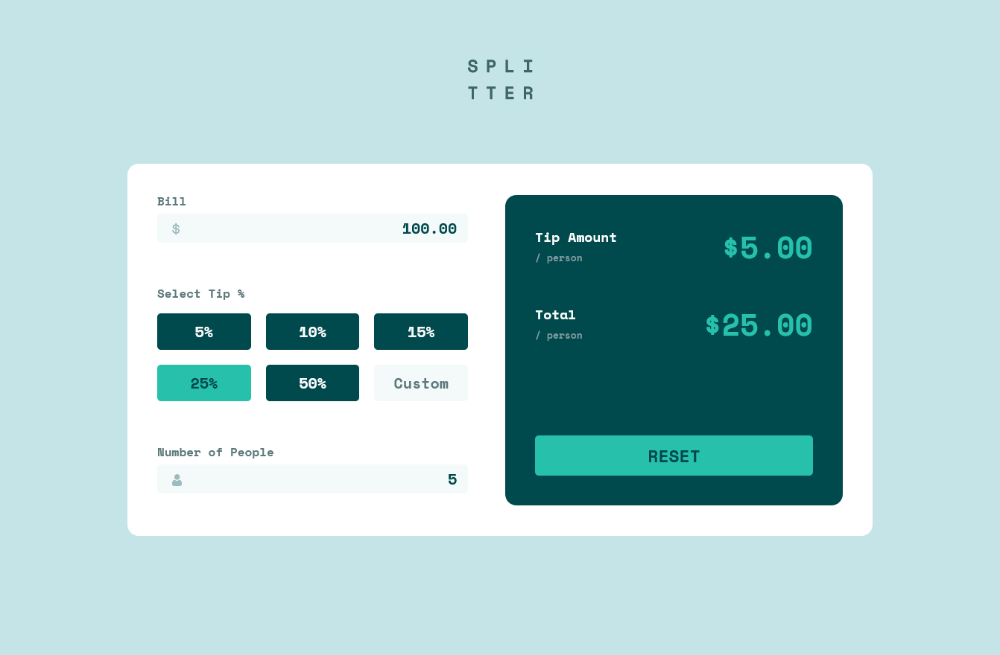

# Frontend Mentor - Tip calculator app solution - REACT

This is my solution to the [Tip calculator app challenge on Frontend Mentor](https://www.frontendmentor.io/challenges/tip-calculator-app-ugJNGbJUX).

## Overview

User can input the bill total and the number of people paying along with selecting a tip amount.

The Tip Amount per Person and the Total per Person update with each input change.

If a zero is inputed to the bill or number of people input an error appears.

### Screenshot

### Links 

- Live Site URL: [Splitter Tip App](https://fem-tip-calculator-react.vercel.app/)

## Process

### Built With

- [React](https://reactjs.org/) - JS library
- Flexbox
- CSS Grid
- Mobile-first Workflow

### What I Learned

I wanted to practice with the `useReducer` hook. So all state runs through it instead of `useState`

The buttons for select tip are actually radio inputs.  I found a way to style them to make them look like regular buttons.

### Resources

- [SoundCode](https://www.markheath.net/post/customize-radio-button-css) - This helped me to style the radio inputs to appear as buttons.
- [Web Dev Simplified](https://www.youtube.com/watch?v=kK_Wqx3RnHk&t) - This video from Kyle was my inital guide to use reducer.  Along with his [Calculator App](https://www.youtube.com/watch?v=DgRrrOt0Vr8)

## Author

- Portfolio [Auddity](https://fem-tip-calculator-react.vercel.app/)
- Frontend Mentor - [Auddity](https://www.frontendmentor.io/profile/Auddity)